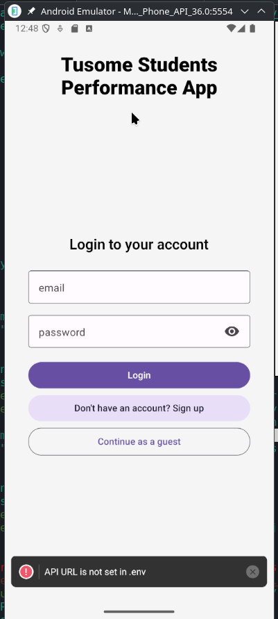

# Tech Stack

React Native (expo) & React Native Paper - Mobile App and UI
Zustand - State Management
FastAPI(Backend) - API and Business Logic
Postgresql(Database) - Data Storage

## To get started

Ensure you have Node (>=v22), Postgresql and Expo app on your mobile app

```bash
git clone https://github.com/wathika-eng/students-performance --depth 1
cd students-performance

cd frontend

# once in the frontend folder
npm install
npm run start # to start the expo server

npm i -g eas-cli # to install eas cli globally

eas login # to login to your expo account

eas build:configure # to configure eas build for android

eas build --platform android # to build an apk for testing
# add --local to build locally (though it requires more setup, java 17, android sdk etc)
```

app: entry point, screen
file based routing, binded by _layout.tsx
index -> executes when app starts

all pages require user to be logged in except login and signup

user can continue as guest (session valid for 5minutes)

view - renders the current screen
text - displays text content on the screen

(tabs) - special folder for tabs/grouping screens/collection of strings

Building an APK for testing

```bash
# https://medium.com/@bulchandani.piyush/installing-an-android-app-bundle-aab-app-on-an-android-device-7235bab4cc49

eas build --platform android  #then download the .aab file from expo website

# generate an apk from the aab file
bundletool build-apks \
  --bundle=application-*.aab \
  --output=app.apks \
  --ks=my-release-key.jks \
  --ks-key-alias=myalias \
  --ks-pass=pass:YOUR_PASSWORD \
  --key-pass=pass:YOUR_PASSWORD \
  --mode=universal

# extract apk
unzip app.apks universal.apk

# finally install the apk locally
```

#### todo

- [] build the backend with FastAPI, mvp
- [] implement fingerprint auth
- [] connect backend to the app

### image demos

Login Page



Overview Page


Profile page


